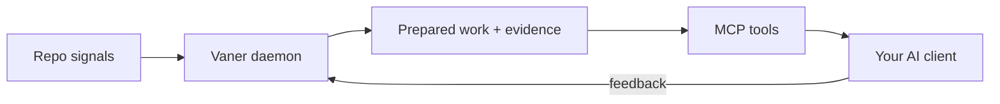

Vaner runs as a small daemon next to your editor. It watches your repo,
prepares work in the background, and serves that work to your AI client
through MCP when you ask. The model never waits on Vaner — Vaner has the
answer ready.

## What you see

- **Your AI client.** Cursor, Claude Code, Codex, Zed, etc. Calls Vaner
  through MCP tools (`vaner.resolve`, `vaner.prepared_work.dashboard`, …)
  to pull prepared work.
- **The cockpit.** A local web UI at `http://127.0.0.1:8473` (started
  with `vaner up`). Shows what Vaner has prepared, why, and what's
  in flight. See [Prepared Work](/prepared-work#inspecting-prepared-work).
- **The desktop app** (optional). A menu-bar / tray shell that wraps
  the daemon, surfaces the most-recent prepared moment, and adopts
  drafts into your active client with one click.

All three talk to the same daemon. None of them are in the model's hot
path — they pull from a queue Vaner keeps populated.

## What Vaner does

When the repo changes (a commit lands, a file changes, a test runs),
Vaner notices and **prepares**. Preparing means: pulling related context,
running the model in idle time, scoring multiple candidate angles, and
landing the strongest as a Prepared Work card with evidence attached.

When you actually ask the agent something, Vaner has the relevant card
ready to hand over instead of starting from a cold retrieval pass.

## Boundaries

- **Non-mutating by default.** Vaner can prepare a virtual diff but
  never applies it. Adopt is an explicit user action.
- **Local-first.** The daemon, the cockpit, and the model all run on
  your machine unless you've chosen a hybrid bundle. Privacy posture
  is part of the [policy bundle](/policy-bundles) you pick at install.
- **Read-only against your code.** Vaner reads the working tree and
  git history; it doesn't write to your branch.

## Going deeper

The internal moving parts (frontier exploration, scenario scoring,
prediction registry, refinement context) aren't user-facing. If you
want them, the source is the canonical reference: see
[`src/vaner/engine.py`](https://github.com/Borgels/vaner/blob/main/src/vaner/engine.py)
and the per-component modules under `src/vaner/`.

For knob-by-knob configuration, see [Configuration](/configuration).
