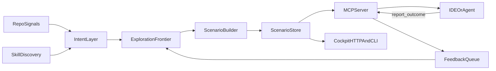

Vaner is built around one default architecture:

- **MCP-first model interface:** your client calls tools; Vaner is not the chat
  completion hot path.
- **Side-running ponder engine:** Vaner precomputes scenarios in the background.
- **Local cockpit controls:** operators inspect, debug, and tune behavior.

## Runtime flow

## Core components and boundaries

### Ponder loop and scenario builder

The daemon watches repo activity, produces artefacts, and continuously expands
ranked scenarios into `scenarios.db`. This is where depth, frontier size,
deduplication, and compute limits are enforced.

### Scenario store and scoring

Each scenario stores prepared context, evidence references, freshness, expansion
cost, and outcomes. Vaner re-scores scenarios so clients can pick promising
candidates quickly via MCP tools.

### Agent skills prior

Vaner can discover active `SKILL.md` files and treat them as intent priors.
Skill metadata contributes to feature extraction, seeds frontier candidates, and
can bias ranking before prompt-time requests arrive.

See [Agent Skills](/skills) for the full loop.

### MCP runtime (model pull)

MCP tools (`list_scenarios`, `get_scenario`, `expand_scenario`,
`compare_scenarios`, `report_outcome`) expose prepared context on demand.
`report_outcome` closes the loop by feeding scenario usefulness back into
frontier adaptation.

### Cockpit runtime (human controls)

Cockpit endpoints and CLI commands expose status, freshness distribution, device
configuration, and live scenario stream updates.

See [Cockpit](/cockpit) for the operator view.

### Optional gateway capability

`vaner proxy` remains available for clients that only support OpenAI-compatible
endpoints. It is an advanced compatibility layer, not the default integration
path.
