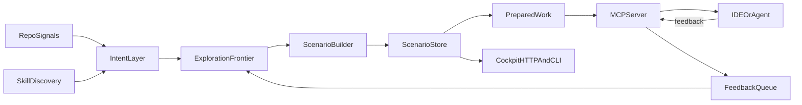

Vaner is built around one default architecture:

- **MCP-first model interface:** your client calls tools; Vaner is not the chat
  completion hot path.
- **Side-running ponder engine:** Vaner precomputes likely useful work in the
  background.
- **Prepared Work surface:** clients see a small, action-oriented feed instead
  of raw prediction/work-product lifecycle state.
- **Local cockpit controls:** operators inspect, debug, and tune behavior.

## Two loops: precompute and serve

- **Ponder loop (background):** watches repo signals, expands frontier
  candidates, and refreshes scenarios, artifacts, predictions, and work
  products in storage.
- **Answer loop (prompt-time):** serves Prepared Work or precomputed context over
  MCP/HTTP when your client asks during a real task.

This split is the core performance model: expensive exploration happens between
prompts, while prompt-time retrieval stays fast and deterministic.

## Runtime flow

## Core components and boundaries

### Ponder loop and scenario builder

The daemon watches repo activity, produces artefacts, and continuously expands
ranked scenarios into `scenarios.db`. This is where depth, frontier size,
deduplication, and compute limits are enforced.

### Scenario store and scoring

Each scenario stores prepared context, evidence references, freshness, expansion
cost, and outcomes. Vaner re-scores scenarios so clients can pick promising
candidates quickly via MCP tools.

### Prepared Work layer

Prepared Work is the product-facing layer above predictions and work products.
It filters hidden/stale/dismissed/superseded items, ranks by usefulness,
confidence, freshness, evidence, and actionability, and returns UI-safe cards
with only server-authorized actions.

Virtual diffs live in Vaner-owned storage. They can be inspected and exported,
but Vaner does not automatically mutate the user's worktree.

### Agent skills prior

Vaner can discover active `SKILL.md` files and treat them as intent priors.
Skill metadata contributes to feature extraction, seeds frontier candidates, and
can bias ranking before prompt-time requests arrive.

See [Client capability matrix](/integrations/client-capabilities) for
the per-client skill / workflow / prompt support and how Vaner's
`vaner-feedback` adapter fits in.

### MCP runtime (model pull)

MCP tools expose Prepared Work, query resolution, scenario navigation,
workspace goals, setup/policy controls, and Deep-Run sessions. Feedback closes
the loop by feeding usefulness signals back into future ranking.

### Cockpit runtime (human controls)

Cockpit endpoints and CLI commands expose status, freshness distribution, device
configuration, and live scenario stream updates.

See [Cockpit](/cockpit) for the operator view.

### Optional gateway capability

`vaner proxy` remains available for clients that only support OpenAI-compatible
endpoints. It is a legacy compatibility layer, not the default integration
path; prefer MCP-first wiring whenever your client supports MCP.
