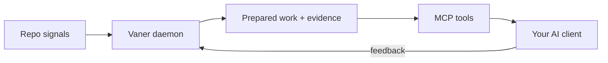

Vaner runs as a small daemon next to your editor. It watches your repo,
prepares work in the background, and serves that work to your AI client
through MCP when you ask. The model never waits on Vaner; Vaner has the
answer ready.

## How you interact with Vaner

Vaner is one local engine with several surfaces around it. MCP is the primary
interface for AI agents. Desktop and Companion are the primary human controls.

| Surface | Primary user | Purpose | Default? | Where documented |
|---|---|---|---|---|
| AI client via MCP | AI agent | Pull Prepared Work and call `vaner.*` tools from Cursor, Claude Code, Codex, Zed, and similar clients. | Yes, for agents | [MCP mode](/integrations/mcp) |
| Desktop tray/taskbar window | Human user | Install, start/stop Vaner, see current status, and wire detected clients. | Yes, for humans | [Getting Started](/getting-started) |
| Companion/settings thin client | Human user | Manage common settings, integrations, backend/runtime choices, and privacy posture. | Yes, through Desktop | [Configuration](/configuration) |
| Cockpit / Web UI | Advanced user | Inspect engine state, priorities, Prepared Work, diagnostics, and live activity. | No, advanced | [Prepared Work](/prepared-work#inspecting-prepared-work) |
| CLI | Power users / CI | Script setup, daemon control, status, doctor, logs, and config. | No | [CLI reference](/cli) |
| Primer/rules, skills, plugins/hooks | AI agent integration | Make MCP usage reliable and client-specific by teaching clients when and how to use Vaner. | Yes, where supported | [Client integration depth](/integrations/client-capabilities) |
| Proxy/gateway | Compatibility users | OpenAI-compatible fallback for tools that cannot call MCP directly. | No | [Proxy mode](/integrations/proxy) |

Users normally do not install Vaner inside the AI client first. Vaner Desktop
or `vaner init` configures the integration; the AI client is where the agent
uses Vaner through MCP.

All surfaces talk to the same daemon. None of them are in the model's hot path;
they pull from a queue Vaner keeps populated.

## What Vaner does

When the repo changes (a commit lands, a file changes, a test runs),
Vaner notices and **prepares**. Preparing means: pulling related context,
running the model in idle time, scoring multiple candidate angles, and
landing the strongest as a Prepared Work card with evidence attached.

When you actually ask the agent something, Vaner has the relevant card
ready to hand over instead of starting from a cold retrieval pass.

## Boundaries

- **Non-mutating by default.** Vaner can prepare a virtual diff but
  never applies it. Adopt is an explicit user action.
- **Local-first.** The daemon, the cockpit, and the model all run on
  your machine unless you've chosen a hybrid bundle. Privacy posture
  is part of the [policy bundle](/policy-bundles) you pick at install.
- **Read-only against your code.** Vaner reads the working tree and
  git history; it doesn't write to your branch.

## Going deeper

The internal moving parts (frontier exploration, scenario scoring,
prediction registry, refinement context) aren't user-facing. If you
want them, the source is the canonical reference: see
[`src/vaner/engine.py`](https://github.com/Borgels/vaner/blob/main/src/vaner/engine.py)
and the per-component modules under `src/vaner/`.

For knob-by-knob configuration, see [Configuration](/configuration).
