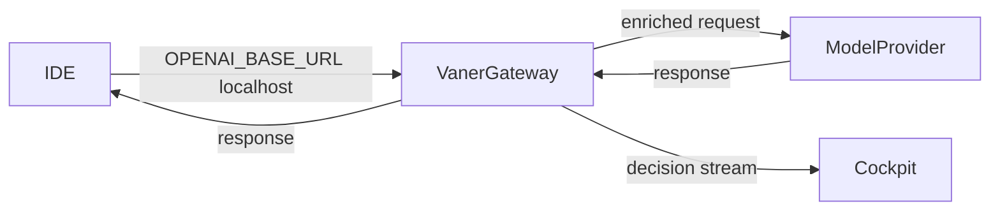

Vaner has two surfaces:

- **Gateway**: request path that enriches prompts with context while preserving your IDE model selection.
- **Cockpit**: visibility path that shows what Vaner did and whether it helped.

## Request path

1. IDE sends a request to `http://127.0.0.1:8471/v1/chat/completions`.
2. Vaner computes context from repo state.
3. Vaner forwards to your backend provider.
4. Response returns in OpenAI-compatible shape.

## Visibility path

- `vaner watch`: live request/decision feed.
- `vaner impact`: sampled shadow comparison summary.
- `vaner show`: local cockpit UI at `/ui`.
- VS Code/Cursor extension: status bar + side panel.
