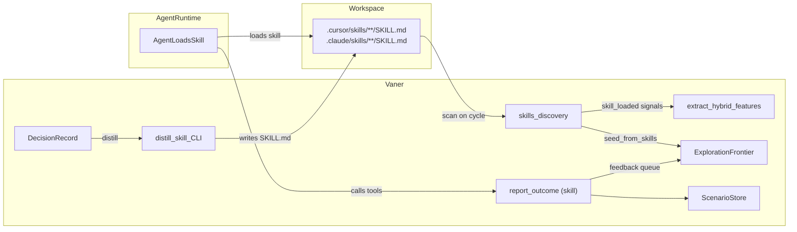

Vaner can treat agent skills as both an input signal and an output artifact.

## Closed loop



## Supported skill roots

- `.cursor/skills/**/SKILL.md`
- `.claude/skills/**/SKILL.md`
- `skills/**/SKILL.md`

By default, Vaner only persists repo-local skills. Global paths are opt-in via:

```toml
[intent]
include_global_skills = true
```

## Authoring a Vaner-aware skill

```yaml
---
name: vaner-predictive-debug
description: Use when diagnosing a failing test.
tags: [debug, tests]
triggers:
  - "tests/**"
  - "pytest"
vaner:
  kind: debug
  expand_depth: 2
  feedback: auto
---
```

- `triggers` help Vaner map skills to likely file sets.
- `vaner.kind` biases scenario matching (`debug`, `explain`, `change`, `research`).

## Auto-feedback

`vaner init` now installs a managed `vaner-feedback` skill under:

- `.cursor/skills/vaner/vaner-feedback/SKILL.md`
- `.claude/skills/vaner/vaner-feedback/SKILL.md`

It teaches agents to close the loop with `report_outcome`.

## Distill a skill from a decision

```bash
vaner distill-skill --path . --name "repo-debug-playbook"
```

This converts a decision record into a managed SKILL.md playbook.

## Disable the loop

```toml
[intent.skills_loop]
enabled = false
```
